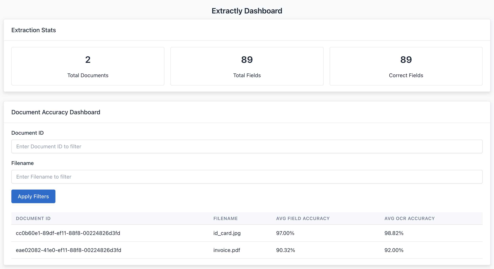
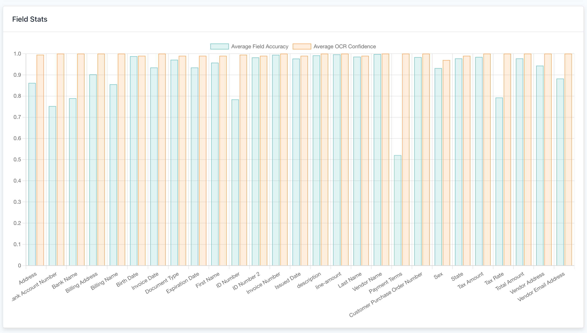

# Extractly

This project provides a web-based dashboard to display document extraction stats, including the average field accuracy and OCR accuracy for each document. It allows users to filter documents by `Document ID` or `Filename`, and dynamically loads data from a backend API.

## Features

- **Document Stats**: Displays the average field accuracy and OCR accuracy for each document.
- **Filters**: Filter document stats by `Document ID` or `Filename`.
- **Data Visualization**: Includes charts for average field accuracy, confidence levels, and OCR confidence across various fields.
- **Backend API**: Fetches data from a backend service to populate the dashboard.

## Project Structure

```sh
.
├── README.md
├── backend
│   ├── Dockerfile
│   ├── app
│   │   ├── api
│   │   ├── database.py
│   │   ├── main.py
│   │   └── models
│   │       ├── __init__.py
│   │       ├── classification_model.py
│   │       └── extraction_model.py
│   ├── pyproject.toml
│   └── uv.lock
├── docker-compose.yml
└──  frontend
   ├── Dockerfile
   └── app
       ├── css
       │   └── process-docs.css
       ├── index.html
       ├── js
       │   └── process-docs.js
       ├── pages
       │   └── process-documents.html
       ├── pdfs
       │   ├── id_card.jpg
       │   └── invoice.pdf
       ├── script.js
       └── style.css
```

## Dashboard




## Setup and Installation

Follow these steps to set up the project locally.

## Prerequisites
	• Python =>3.10

## Backend Setup

1.	Clone this repository:

    ```sh
    git clone https://github.com/nvpnathan/extractly.git
    cd extractly/backend
    ```

2.	Install Python dependencies:

    ```sh
    brew install uv
    uv venv
    source .venv/bin/activate
    uv sync
    ```

3.	Point to your sqlite document database

4.	Run the backend API:

    ```sh
    uvicorn main:app --reload
    ```

### Running the Dashboard

Once the backend is running:

1.	Open the `index.html` file in your browser to view the dashboard.

The dashboard should now be accessible and will automatically load document stats from the backend.


## API Endpoints

### Extraction Records

#### Get All Extractions
```http
GET /extractions/
```
Retrieves a paginated list of all extraction records.

**Query Parameters:**
- `skip` (optional): Number of records to skip (default: 0)
- `limit` (optional): Maximum number of records to return (default: 10)

**Response:**
```json
{
    "data": [
        {
            // extraction record fields
        }
    ]
}
```

#### Get Extractions by Document ID
```http
GET /extractions/{document_id}
```
Retrieves all extraction records for a specific document.

**Path Parameters:**
- `document_id`: Unique identifier of the document

**Response:**
```json
{
    "data": [
        {
            // extraction records for the document
        }
    ]
}
```

### Statistics

#### Get Document Statistics
```http
GET /document_stats
```
Retrieves accuracy statistics grouped by document.

**Query Parameters:**
- `filename` (optional): Filter results by filename (partial match)
- `document_id` (optional): Filter results by document ID (partial match)

**Response:**
```json
[
    {
        "document_id": "string",
        "filename": "string",
        "avg_field_accuracy": "float",
        "avg_ocr_accuracy": "float"
    }
]
```

#### Get Field Statistics
```http
GET /extractions/field-stats/
```
Retrieves accuracy statistics grouped by field type.

**Response:**
```json
[
    {
        "field_id": "string",
        "field": "string",
        "avg_field_accuracy": "float",
        "avg_confidence": "float",
        "avg_document_ocr_confidence": "float"
    }
]
```

#### Get Overall Statistics
```http
GET /extractions/stats/
```
Retrieves summary statistics for all extractions.

**Response:**
```json
{
    "total_documents": "integer",
    "total_fields": "integer",
    "correct_fields": "integer"
}
```

Each endpoint supports standard HTTP response codes:
- `200`: Successful request
- `400`: Bad request (invalid parameters)
- `404`: Resource not found
- `500`: Server error


## TODO

&#9745; Group Classification Confidence Distribution into % buckets

&#9745; Limit Document Accuracy to limit of 20 with scroll

&#9745; Field Extraction data should be linked to Document Accuracy by filename

&#9745; Add conditional to prevent negative confidence scores to Field Extraction
